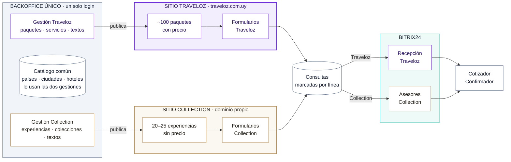
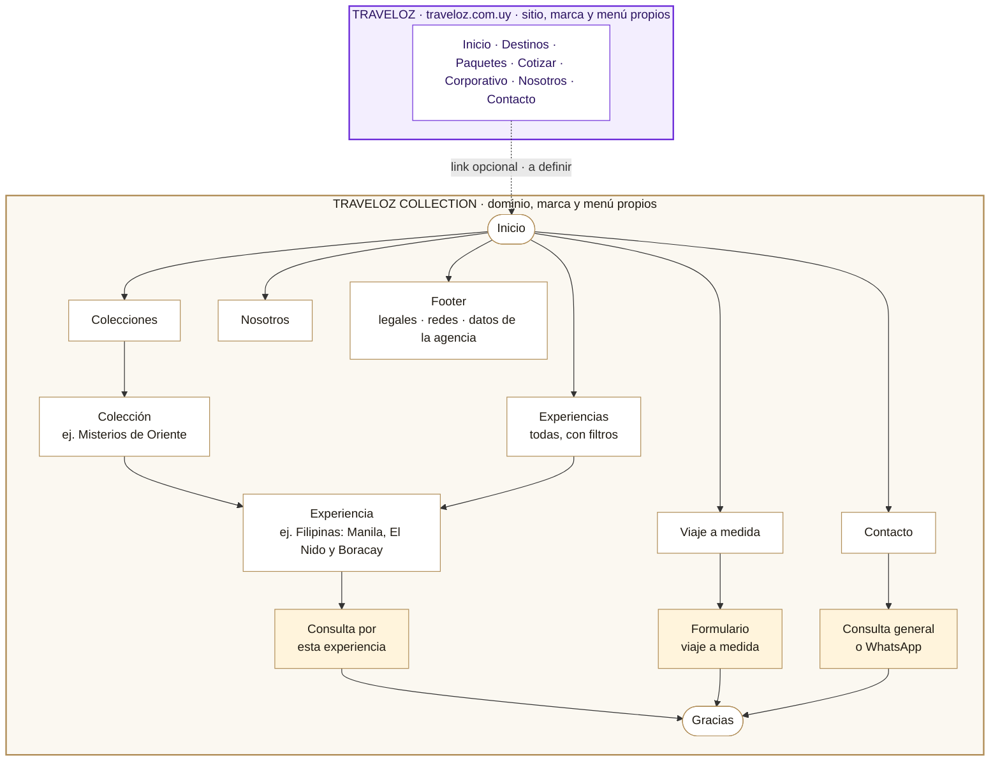
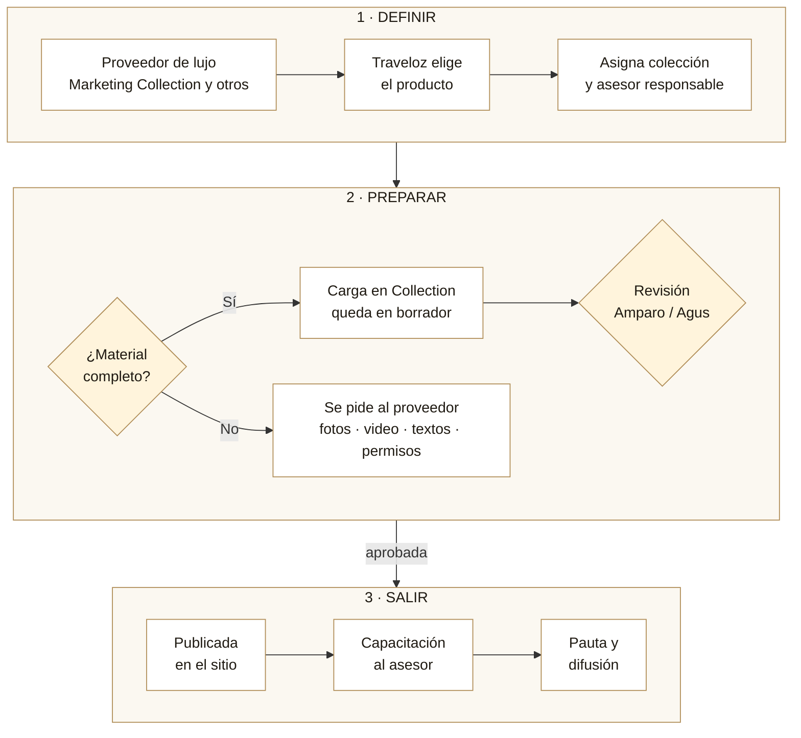
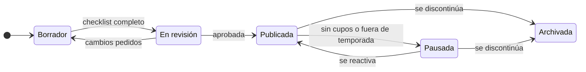
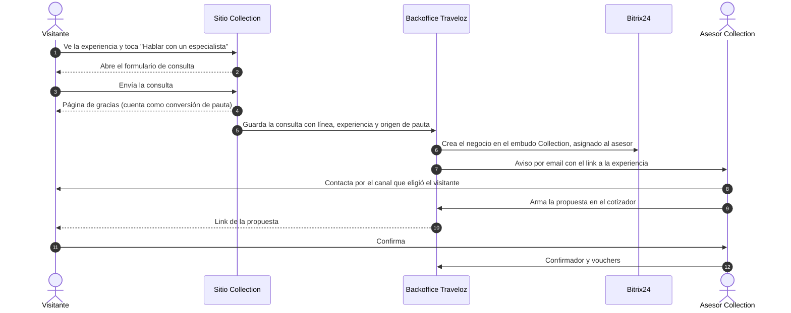
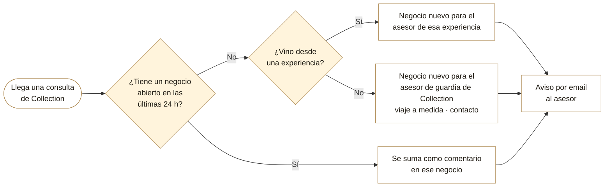
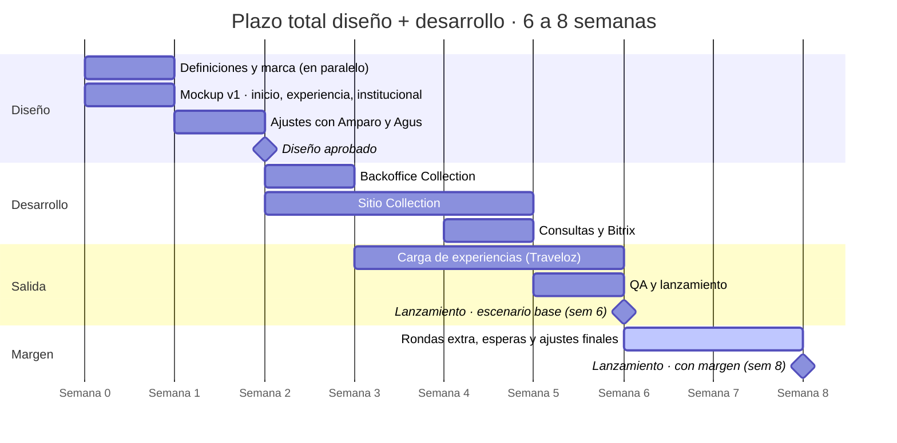

# Traveloz Collection — Propuesta funcional y flujo de negocio

**Versión 3 · 15/09/2026** · Diego Castaño (Latitud Nómade)
Basado en la reunión del 10/09, las referencias que pasó Gero y lo que ya tiene hoy la plataforma de Traveloz.
Este documento se enfoca en **qué hace el producto y cómo funciona el negocio**. El detalle técnico va aparte, en la etapa de desarrollo.

---

## 1. En una página

**Collection es la vertical de lujo de Traveloz.** Es un sitio aparte, con marca, dominio y menú propios, que muestra entre 20 y 25 **experiencias**. No son paquetes: se venden con imagen, video y relato, sin precio a la vista. Cada experiencia tiene su formulario, y la consulta llega directo al asesor responsable de ese producto.

Para el público son **dos sitios distintos**. Para el equipo es **un solo backoffice**, con el mismo usuario y contraseña, y el catálogo de países, ciudades y hoteles que ya está cargado no se vuelve a cargar.

**Lo que más va a definir el éxito es el contenido**: fotos, videos y textos a la altura. El sitio es la vitrina, pero sin material de calidad no cumple la promesa.

> ### ⏱ Plazo total: **6 a 8 semanas**, diseño y desarrollo incluidos
> - **6 semanas** si las aprobaciones y el material llegan a tiempo.
> - **8 semanas** como máximo, con margen para rondas extra de ajustes y esperas de respuesta.
> - La capacitación de asesores se hace **después** del lanzamiento. La carga de experiencias por parte de Traveloz arranca en la **semana 4**, apenas está listo el backoffice, en paralelo con el desarrollo del sitio.

---

## 2. Qué es Collection y en qué se diferencia de Traveloz

| | **Traveloz** | **Traveloz Collection** |
|---|---|---|
| Producto | Paquetes y circuitos | Experiencias: viajes de autor, hoteles, cruceros, trenes |
| Volumen | ~100 paquetes | 20–25 experiencias |
| Precio | Visible en cada paquete | No se muestra (opción de "desde" por experiencia) |
| Cómo se vende | Qué incluye y cuánto cuesta | Qué vas a vivir y sentir |
| Contenido | Foto, bullets, itinerario | Galería grande, video, relato por destino, día a día narrado |
| Organización | Por región y destino | Por **colecciones** (temáticas o regionales) |
| Conversión | Formulario de cotización (fecha obligatoria) | Formulario de consulta con fechas flexibles y calificación |
| Quién atiende | Recepción → vendedores | **Asesor asignado a cada experiencia** |
| Proveedor principal | Varios mayoristas | Marketing Collection (más otros de lujo) |
| Estética | Violeta y teal, dinámica | Blanco dominante, grises, dorado como detalle |
| Dominio | traveloz.com.uy | Propio (a definir) |

---

## 3. Arquitectura: dos sitios, un solo backoffice

**Cómo leer el diagrama:**
- **Arriba (violeta), Traveloz.** Sigue exactamente como está hoy; Collection no le cambia nada.
- **Abajo (dorado), Collection.** Es un sitio independiente: el visitante nunca ve paquetes de Traveloz ni comparte menú con ese sitio.
- **A la izquierda, el backoffice único.** El equipo entra con su usuario de siempre y encuentra una sección nueva, "Collection". Las dos gestiones usan el mismo catálogo de países, ciudades y hoteles.
- **A la derecha, las consultas.** Cada consulta queda marcada con su línea: las de Traveloz siguen yendo a recepción y las de Collection van a los asesores de lujo. El cotizador y el confirmador son los mismos para ambas líneas.

### Qué se comparte y qué es independiente

| Se comparte | Es independiente |
|---|---|
| Usuario, contraseña y permisos | Dominio, marca, logo y paleta |
| Países, ciudades y hoteles (con sus fotos) | Menú, header, footer y páginas |
| Panel de consultas (con filtro por línea) | Productos: experiencias ≠ paquetes |
| Cotizador y confirmador | Textos institucionales |
| Integración con Bitrix | Embudo y asesores en Bitrix (a confirmar) |
| Subida de fotos y videos | Formularios y página de gracias |
| Servidor y mantenimiento | Medición y campañas de pauta |

> **Por qué así:** es lo que acordamos en la reunión (un solo login, no recargar el catálogo, "como hicimos con el cotizador"), y al mismo tiempo garantiza que nada de Collection aparezca por error en traveloz.com.uy.

---

## 4. Mapa del sitio

### Menú principal
**Colecciones ▾** · **Experiencias** · **Viaje a medida** · **Nosotros** · **Contacto** · botón destacado **"Hablar con un especialista"**

### Para qué sirve cada página

| Página | Objetivo | Acción principal |
|---|---|---|
| Inicio | Impactar y mostrar la propuesta en 10 segundos | Entrar a una colección o experiencia |
| Colecciones | Mostrar los mundos temáticos | Elegir una colección |
| Colección | Contar el concepto y listar sus experiencias | Entrar a una experiencia |
| Experiencias | Ver todo junto y filtrar | Entrar a una experiencia |
| **Experiencia** | **Enamorar y convertir** | **Consultar** |
| Viaje a medida | Captar a quien no encontró "su" experiencia | Completar el formulario calificador |
| Nosotros | Dar confianza (depende de la decisión de marca) | Contactar |
| Contacto | Canal directo | Consultar o escribir por WhatsApp |
| Gracias | Confirmar el envío y contar qué pasa ahora | Seguir explorando |

---

## 5. Funcionalidades del sitio

### 5.1 Inicio
- **Portada a pantalla completa con video** (sin sonido, también en celular) y una frase de marca.
- **Manifiesto corto**: dos o tres líneas sobre qué es Collection.
- **Colecciones** en tarjetas grandes con imagen y una bajada evocadora.
- **Experiencias destacadas** en carrusel.
- **Cómo trabajamos** en 3–4 pasos: nos contás → diseñamos → reservamos → viajás acompañado.
- **Inspiración por estilo** (opcional): luna de miel, familia, safari, bienestar, gastronomía.
- **Historias de viajeros**, cuando haya testimonios reales.
- **Cierre** con invitación al viaje a medida.

### 5.2 Colección
- Portada, relato de la colección y grilla de sus experiencias.
- Si todavía no tiene experiencias, se muestra **"Próximamente"**: permite lanzar con la estructura completa aunque falte producto.

### 5.3 Experiencias (índice)
- Todas las experiencias con filtros simples: colección, región, tipo (viaje, hotel, crucero, tren) y duración.

### 5.4 Experiencia (la página más importante)
En este orden:
1. **Galería inmersiva o video** de portada, con pantalla completa.
2. **Título y bajada** evocadora.
3. **Datos rápidos:** noches · destinos · mejor época · tipo de experiencia.
4. **Lo imperdible:** 4 a 6 momentos destacados.
5. **El relato de cada destino:** un párrafo por lugar, con su imagen. Es el pedido de la reunión de "contar el lugar".
6. **Día a día** narrado y agrupado por destino.
7. **Dónde te vas a alojar:** los hoteles, con fotos y un texto propio.
8. **Qué incluye y qué no.**
9. **Información práctica:** idioma, moneda, cómo llegar, visado y vacunas.
10. **Precio "desde"**, solo si se activa para esa experiencia.
11. **Botón siempre visible "Hablar con un especialista"**, que abre el formulario (en celular, desde abajo), más WhatsApp.
12. **Descargar PDF** de la experiencia con la marca Collection.
13. **Compartir** por WhatsApp o copiando el link: las decisiones de viaje se toman en pareja o en familia.
14. **Más experiencias** de la misma colección.

### 5.5 Viaje a medida
- Propuesta de valor del servicio a medida y proceso.
- **Formulario calificador:** destinos soñados, época, duración, pasajeros, ocasión, estilo de viaje, rango de inversión y canal preferido.

### 5.6 Nosotros y Contacto
- **Nosotros:** página propia o link al de Traveloz, según la decisión de marca (ver §8.1).
- **Contacto:** datos, horario, WhatsApp y formulario corto.

### 5.7 Formulario de consulta (en cada experiencia)
| Dato | Detalle |
|---|---|
| Nombre, email, teléfono | Obligatorios |
| ¿Tenés fechas? | "Sí" → rango de fechas · "Todavía no" → mes aproximado. **La fecha no es obligatoria**, a diferencia de Traveloz |
| Noches aproximadas | Opcional |
| Pasajeros | Adultos y niños |
| Ocasión | Luna de miel · aniversario · familia · amigos · otro |
| Rango de inversión por persona | Opcional, a confirmar (ver §8.3) |
| Canal preferido | WhatsApp · llamada · email |
| Comentarios | Libre |
| Acepto recibir novedades | Casilla de consentimiento |

### 5.8 Página de gracias
- Confirma el envío y dice **qué pasa ahora** ("un especialista te va a contactar en las próximas X horas hábiles").
- Sugiere seguir explorando otras experiencias.
- Cuenta como **conversión** para las campañas.

### 5.9 Transversales
- **Pensado primero para celular.** La mayor parte del tráfico de pauta llega por ahí.
- **Microanimaciones sutiles** al hacer scroll; nada que distraiga.
- **Carga rápida**, aun con videos: siempre hay una imagen de portada mientras carga.
- **WhatsApp flotante** (¿número propio de Collection?).
- **Preparado para Google:** textos y links para compartir por experiencia.
- **Aviso de cookies y consentimiento** de datos.
- **Solo español** en esta etapa.

---

## 6. Funcionalidades del backoffice

Una sección nueva, **"Collection"**, dentro del mismo panel de siempre.

### 6.1 Experiencias
- **Crear, duplicar, editar y ordenar** experiencias, y marcar cuáles son **destacadas** en el inicio.
- **Carga por secciones**, en el mismo orden en que se ve la página: contenido, destinos y relato, día a día, hoteles, fotos y video, ficha práctica, precio, comercial y Google.
- **Destinos:** se eligen de la lista de ciudades que ya existe. **No se cargan países ni ciudades de nuevo.**
- **Hoteles:** se eligen del catálogo de alojamientos que ya existe, con sus fotos. Cada experiencia le agrega **su propio texto** sin tocar la ficha original.
- **Fotos y videos:** subida, orden, recorte del encuadre y crédito del fotógrafo cuando el proveedor lo pide.
- **Asignaciones:** colección o colecciones, **asesor responsable** y proveedor (este último es interno y no se muestra).
- **Precio "desde":** apagado por defecto, se prende por experiencia.
- **Indicador de completitud:** muestra qué falta antes de poder publicar.
- **Vista previa** en celular y escritorio antes de publicar.
- **Estados:** borrador → en revisión → publicada → pausada / archivada (ver §7.2).
- **Registro** de quién publicó o cambió qué.

### 6.2 Colecciones
- Crear, nombrar, escribir el relato, subir imagen o video, ordenar y marcar como "próximamente".

### 6.3 Textos del sitio
- Inicio, nosotros, viaje a medida, contacto, legales, textos para Google, redes y WhatsApp. Se editan con vista previa, igual que hoy en "Frontend".

### 6.4 Consultas
- Las consultas de Collection se ven **separadas** (filtro por línea), con la experiencia de origen, la campaña de la que vino y si llegó bien a Bitrix.
- Se pueden exportar.

### 6.5 Asesores y avisos
- Marcar qué usuarios **atienden Collection** y cuál es su usuario de Bitrix.
- Definir el **asesor de guardia** para las consultas que no vienen de una experiencia.
- Definir **a quién le llegan los avisos** por email.

### 6.6 Permisos
- Quién puede **editar**, quién puede **publicar** y quién solo **ver** (a definir con Traveloz).

---

## 7. Flujos de negocio

### 7.1 De producto a publicación
Es la secuencia que describió Gero: definir productos → asignar vendedor → capacitar, **con la web lista antes de la capacitación**.

### 7.2 Ciclo de vida de una experiencia

- **Pausada:** la experiencia deja de verse sin perder nada (fuera de temporada, sin cupos, cambio de proveedor).
- **Archivada:** se discontinúa. Su link no da error: lleva a la colección.

### 7.3 Una consulta de punta a punta

### 7.4 A quién le llega cada consulta

---

## 8. Cosas a tener en cuenta

### 8.1 Marca y posicionamiento
- **¿"Collection by Traveloz" o marca independiente?** La respuesta define si hace falta un "Nosotros" propio, qué dice el footer, cuánta confianza "hereda" de Traveloz y cómo se posiciona en Google.
- **La experiencia de lujo no termina en el sitio.** Si después de la consulta el pasajero recibe una propuesta del cotizador, emails, un PDF o una confirmación con la estética de Traveloz, se rompe la promesa. Hay que decidir si esas piezas tienen **versión Collection**: logo, colores y firma del asesor.
- **Tono de escritura:** en segunda persona, sensorial, con relato ("vas a despertar frente a…") y no listados de visitas. Definir si se usa voseo uruguayo o un español más neutro.
- **WhatsApp y remitente de emails:** ¿los de Traveloz o propios de Collection?

### 8.2 Contenido (el punto crítico)
- **Checklist mínimo por experiencia:** portada, al menos 6 fotos de calidad, video opcional, intro, relato de cada destino, día a día, hoteles, qué incluye y lo imperdible.
- **Derechos de uso:** confirmar por escrito con Marketing Collection que las fotos y los videos se pueden usar en la web **y en la pauta**, y si exigen crédito.
- **Traducción y adaptación:** el material del proveedor suele venir en inglés o portugués y con tono de catálogo. Hay que reescribirlo, no solo traducirlo.
- **Un responsable de contenido** del lado de Traveloz: quién escribe, quién aprueba y quién mantiene.
- **Lanzar con estructura completa:** es mejor salir con todas las colecciones visibles y al menos 2 experiencias impecables en cada una (el resto en "próximamente") que con 25 a medio hacer.

### 8.3 Comercial y atención
- **Quiénes son los asesores**, cuántos, y quién cubre cuando uno no está (guardia y vacaciones).
- **Tiempo de respuesta:** en lujo, la velocidad es parte del servicio. Sugerimos un compromiso visible, por ejemplo menos de 2 horas hábiles.
- **Capacitación por producto** antes de que salga la pauta de cada experiencia.
- **Rango de inversión en el formulario:** califica mejor y ahorra tiempo, pero puede incomodar. Una opción es dejarlo opcional, con rangos amplios.
- **Embudo propio en Bitrix:** permite medir la conversión del lujo por separado.
- **Duplicados entre líneas:** si alguien con un negocio abierto en Traveloz consulta por Collection, ¿lo toma el asesor de lujo o se suma al negocio existente? Recomendación: **Collection abre su propio negocio**.

### 8.4 Pauta y medición
- **Campañas y conversiones separadas** de Traveloz, con su página de gracias propia. El seguimiento del origen de cada consulta ya existe y se reutiliza.
- **Un sitio nuevo arranca sin posicionamiento en Google:** al principio el tráfico depende de pauta, redes y del link desde Traveloz (si se decide).
- **Si el dominio es propio:** hay que dar de alta las propiedades nuevas en Google (Search Console y Ads) y en Meta.
- Coordinar con Fede Vila.

### 8.5 Legales
- **La agencia responsable** (razón social y habilitación) tiene que figurar igual que en Traveloz.
- **Términos y privacidad** propios o compartidos, con consentimiento de datos.
- **Si se muestra un precio "desde":** aclarar que es por persona, en base doble, sujeto a disponibilidad y cambios.

### 8.6 Operación en el tiempo
- **Estacionalidad:** pausar experiencias fuera de temporada en lugar de borrarlas.
- **Cambios en hoteles compartidos:** si se cambian las fotos o el nombre de un hotel en el catálogo, el cambio impacta en los dos sitios.
- **Revisión trimestral** de contenidos y experiencias.
- **Newsletter:** ¿lista propia de Collection?
- **A futuro:** armar una propuesta en el cotizador **directamente desde una experiencia**.

---

## 9. Reglas de negocio

| # | Regla |
|---|---|
| RN01 | Las experiencias solo se ven en Collection y los paquetes solo en Traveloz. |
| RN02 | Sin precio por defecto; el "desde" se activa experiencia por experiencia. |
| RN03 | Toda experiencia publicada tiene un asesor responsable. |
| RN04 | Consulta desde una experiencia → asesor de esa experiencia. Consulta sin experiencia → asesor de guardia de Collection. |
| RN05 | Si la misma persona vuelve a consultar dentro de las 24 h, se suma a su negocio abierto, solo dentro de Collection. |
| RN06 | La fecha de viaje es flexible: se acepta "todavía no sé" con un mes aproximado. |
| RN07 | Para publicar: portada, al menos 6 fotos, intro, al menos un destino con relato, día a día, asesor asignado y texto para Google. |
| RN08 | El proveedor nunca se muestra al público. |
| RN09 | Una experiencia discontinuada se archiva, no se borra, y su link lleva a la colección. |
| RN10 | Las fotos llevan crédito cuando el proveedor lo exige. |
| RN11 | Los textos de Collection son propios aunque el hotel o el destino sean compartidos. |
| RN12 | El equipo ve el sitio completo antes del lanzamiento; el público, recién desde el lanzamiento. |

---

## 10. Qué necesitamos de Traveloz

| Entregable | Para cuándo | Responsable sugerido |
|---|---|---|
| Nombre final y dominio | Etapa 0 | Gero |
| Logo y paleta básica | Etapa 0 (el mockup arranca igual con una paleta provisoria) | Gero / diseñador |
| Lista de colecciones y de experiencias | Etapa 0–1 | Gero / Amparo |
| 3 experiencias piloto con material completo | Etapa 1 | Amparo |
| Aprobación del mockup | Fin de la etapa 1 | Amparo / Agus |
| Asesores de Collection y sus usuarios de Bitrix | Etapa 2 | Gero |
| Textos institucionales | Etapa 2 | Amparo / Agus |
| Permisos de uso de imágenes y videos | Antes de publicar | Gero con Marketing Collection |
| Datos legales de la agencia | Etapa 3 | Gero |
| Definición de pauta y medición | Etapa 3 | Fede Vila |
| Carga de las experiencias | Etapas 3–5 | Amparo |

---

## 11. Etapas y cronograma

> ### El plazo total entre diseño y desarrollo es de **6 a 8 semanas**
> Son 6 semanas en el escenario base, más hasta 2 semanas de margen. El plazo empieza a correr con el arranque del mockup.

| Etapa | Semanas | Qué se hace | Qué ve y aprueba Traveloz |
|---|---|---|---|
| **0 · Definición** | Semana 1 (en paralelo) | Respuestas a las preguntas abiertas, marca y dominio | Resumen de decisiones |
| **1 · Diseño** | Semanas 1–2 | Prototipo navegable en celular y computadora, en tres partes: inicio (2 alternativas), experiencia (con un piloto real) e institucional con formulario | Aprobación escrita del diseño al cierre de la semana 2 |
| **2 · Backoffice** | Semana 3 | Sección Collection en el panel | **Traveloz ya puede empezar a cargar experiencias** mientras se termina el sitio |
| **3 · Sitio** | Semanas 3–5 | Todas las páginas, animaciones, versión celular y Google | Sitio completo, visible solo para el equipo |
| **4 · Consultas** | Semana 5 | Formularios, avisos, Bitrix por asesor y filtro de consultas | Consultas de prueba en el embudo y con el asesor correctos |
| **5 · Salida** | Semana 6 | Revisión final en dispositivos reales, dominio y lanzamiento | **Sitio público** → capacitación de asesores |
| **Margen** | Semanas 7–8 | Rondas extra de ajustes, esperas de material o respuestas, detalles finales | Lanzamiento, a más tardar al cierre de la semana 8 |

*El eje cuenta semanas desde el arranque: "Semana 0" es el día uno y "Semana 8" el tope.*

### Qué puede mover el plazo de 6 a 8 semanas
| Factor | Cómo evitarlo |
|---|---|
| Rondas de diseño de más | Un solo interlocutor que consolide los comentarios (Amparo o Agus) y aprobación por escrito al cierre de la semana 2 |
| Logo o paleta que no llegan | El diseño arranca con una paleta provisoria (blanco, gris Traveloz y dorado) y el logo se reemplaza después |
| Material de las experiencias piloto incompleto | Confirmar los 3 pilotos y sus permisos antes de la semana 1 |
| Asesores o Bitrix sin definir | Tener nombres y usuarios de Bitrix antes de la semana 5 |
| Dominio sin comprar o sin configurar | Definirlo en la semana 1 |

> **Lo que no entra en las 6–8 semanas:** los opcionales de §12, que se presupuestan aparte, y el tiempo que le lleve a Traveloz completar la carga de las 20–25 experiencias. El sitio puede salir con todas las colecciones visibles y las experiencias que no estén listas en "próximamente".

---

## 12. Opcionales para después

| Opcional | Qué resuelve |
|---|---|
| **Carga asistida con IA desde el PDF del proveedor** | Arma un borrador de la experiencia en español a partir del material de Marketing Collection. Acelera mucho la carga. |
| Página "Hoteles de la colección" | Muestra los hoteles icónicos con los que se trabaja (autoridad de marca). |
| Asistente "Diseñá tu viaje" | Preguntas guiadas (época, objetivo, destino) que califican al visitante antes del formulario. |
| Cotizar desde la experiencia | El asesor abre el cotizador con la experiencia ya precargada. |
| Versión Collection del cotizador y el confirmador | Mantiene la estética de lujo después de la consulta. |
| Historias de viajeros | Testimonios con foto por experiencia. |
| Tarjeta de regalo | Se mencionó en la reunión como una idea interesante; hay que definir el flujo de pago. |

---

## 13. Preguntas abiertas

**Marca**
1. ¿Nombre final "Traveloz Collection"? ¿Subdominio, dominio propio o sección de traveloz.com.uy?
2. ¿Se muestra "by Traveloz"? ¿"Nosotros" propio o compartido?
3. ¿WhatsApp y remitente de emails propios o los de Traveloz?

**Producto**
4. Nombres y criterio de las colecciones (temáticas o por región) y lista inicial de experiencias.
5. ¿Qué 3 experiencias sirven de piloto?
6. ¿Se muestra el precio "desde" en alguna experiencia?
7. ¿Se incluyen hoteles, cruceros o trenes como experiencias en sí mismas, o solo viajes?

**Comercial**
8. ¿Quiénes son los asesores de Collection? ¿Quién cubre la guardia?
9. ¿Embudo propio en Bitrix?
10. ¿Se pide el rango de inversión en el formulario?
11. ¿Qué tiempo de respuesta se compromete?

**Contenido y legales**
12. ¿En qué formato llega el material del proveedor y con qué permisos de uso?
13. ¿Quién escribe y quién aprueba los textos?
14. ¿El PDF de cada experiencia lo generamos nosotros o se usa el del proveedor?
15. ¿Términos y privacidad propios?

**Medición**
16. ¿Pauta y medición compartidas o separadas de Traveloz?
17. ¿Newsletter propia?

---

## 14. Qué tomamos de cada referencia

| Referencia | Qué tomamos |
|---|---|
| **Just Tur** (la que más gustó) | Colecciones temáticas con nombre evocador, "próximamente" para las vacías, y la estructura de la ficha: día a día agrupado por destino con su hotel, PDF y "hablar con un especialista". |
| **Marketing Collection** | Dorado muy sutil, "collection" en cursiva y los tipos de producto: hoteles, receptivos, trenes, cruceros e islas. |
| **Teresa Perez** | Inspiración por estilo de viaje, botón "Planeá tu viaje" siempre visible, video de portada y preguntas guiadas para calificar. |
| **Singular Luxury Travel** | Historias de viajeros, manifiesto y "cómo funciona". |
| **Lando Travel** | Proceso en pasos, estilos de viaje y logos de marcas asociadas. (Evitamos el aire de plantilla que se notó en la reunión.) |
| **Elemento** | Formulario calificador con fechas flexibles, noches aproximadas, ocasión y rango de inversión. |
